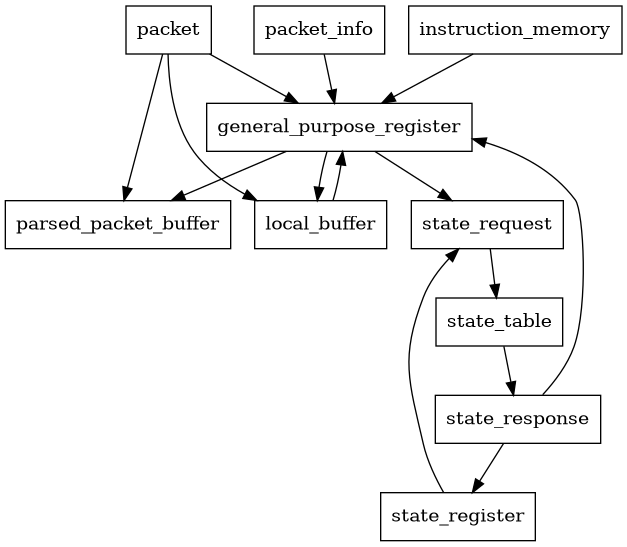
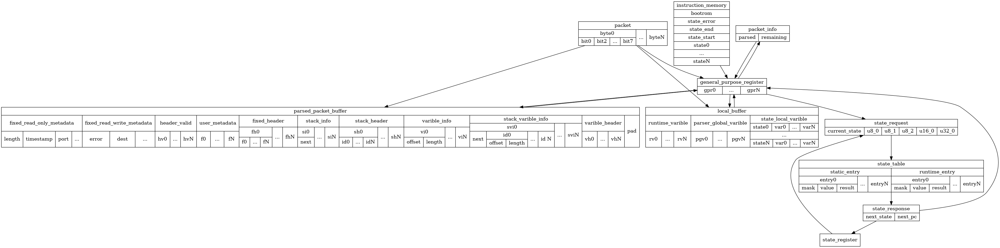
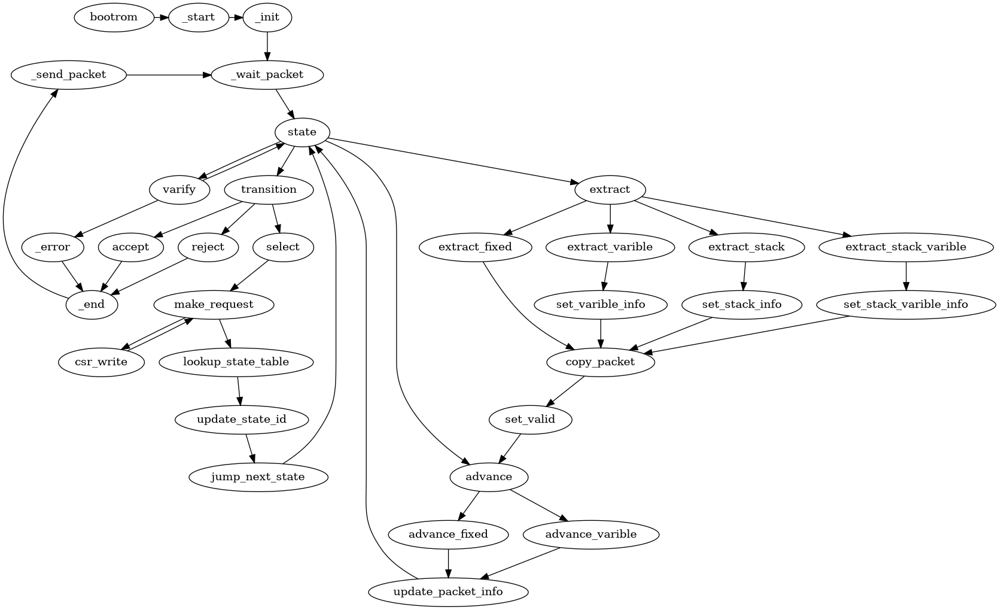

# parser high level design

## 简介

本文为parser的设计文档

## 模块设计

parser是以通用cpu为基础，与扩展数据存储和扩展指令为功能核心，使用cpu指令控制的，用于报文处理的功能模块。

输入的数据经过parser处理后，转变为可以被后续数据处理模块处理的数据结构。

报文处理使用的指令由编译器生成。

parser模块的数据流图如下

parser中包含的的数据存储区包括：

* instruction_memory 存储parser程序使用的指令
* packet 输入的报文bit流
* packet_info 记录当前报文已被处理的数据长度和剩余数据长度
* parsed_packet_buffer 存储硬件元数据、用户元数据、被解析后报文数据副本
* general_purpose_register cpu的通用寄存器
* local_buffer 存储parser的全局变量、局部变量，运行时变量
* state_register 存储parser的当前state值，用于加速state查表流程
* state_table 存储state代码段的指令跳转地址
* state_request 存储state查表请求
* state_response 存储state查表结果

## 数据存储区详细设计

各个数据区的模块详情如下图所示

### instruction_memory

instruction_memory为一段线性的只读的数据区，存储parser程序使用的指令，其中的指令由编译器生成，由parser cpu模块pc寄存器读取，pc由指令控制跳转。

其中代码段由编译器代码生成，每一个state对应一段连续的指令段，当一个state完成处理后，跳转至state查表结果中存储的地址，并进行下一个state的处理。当运行时产生错误时，跳转至代码错误的指令段。

在parser启动后，代码从bootrom开始执行并进行初始化代码，然后跳转state_start开始处理报文。

### packet

packet为一段只读的数据区，存储输入的报文数据。

### packet_info

packet_info为一块专用的寄存器，由生成的指令操作维护，其中的parsed记录着packet中的已处理的数据的长度，remain记录数据的剩余长度。

当收到报文并开始处理时，parsed初始化为0，remaining初始化为报文的总长度。

当extract或advance一定长度报文时，parserd增加、remaining减少相应的长度值，并通过判断remaining校验操作是否成功

### parsed_packet_buffer

parsed_packet_buffer是一段线性存储区，存储报文解析的结果。parsed_packet_buffer中的数据分区由编译器进行分配，数据的填充由指令操作完成，可以从packet中把数据复制到该区域。

其中的子数据区域如下

fixed_read_only_metadata 存储架构相关的用户只读的标准元数据，例如报文总长、时间戳、报文的输入端口等。其中的数据排布与架构设计相关，一般数据从packet起始位置获取。

fixed_read_write_metadata 存储架构相关的用户可读可写的标准元数据，例如错误状态码、报文发送的目的等。其中的数据排布与架构设计相关，一般数据从packet起始位置获取。

header_valid 存储所有分配的header的valid状态值，每个header使用1bit，总长度为代码中声明的header的总数。其中每一个字段与header的对应关系由编译器分配。初始值为0，当extract时对应为置1。

user_metadata 存储由用户声明的元数据，数据总长在编译期确定。不进行初始化。

fixed_header 为所有header中声明的固定长度的header的集合，每一个header分配一段空间，顺序由编译器分配。在extract操作时时从packet复制数据至该区域，并置位header_valid。

stack_info 为固定长度stack的栈顶迭代器值，表示已存储的stack数量，stack header数据在stack_header区。初始值为0，当stack_header中存入数据时，从stack_info区获取栈顶偏移值，并作有效值判断，写入完成后更新该值。

stack_header 为固定长度stack的header数据存储区，数据空间总长在编译器确定。

varible_info 为可变长header数据的信息区，可变长header存储于varible_header区，这里存储varible_header区中的相对偏移和长度。数据空间总长在编译器确定。

stack_varible_info 存储可变长header的已存储的stack数量和其中每一个可变长header的在varible_header区的相对偏移和长度。数据空间总长在编译器确定。

varible_header 区存储所有的可变长header数据，由指令维护该区域的已使用的长度，当有可变长数据被存储时，从上一次已使用的偏移地址开始存储数据，然后把偏移和长度存储至对应header的info区。varible_header区的起始地址在编译时确定，若运行时extract超出空间范围，由指令进行剩余长度检查并进入错误状态。

### general_purpose_register

general_purpose_register 指cpu的通用寄存器，完成处理过程中的数值运算、逻辑运算、流程控制等操作。

### local_buffer

local_buffer 是parser运行周期内的变量存储空间。

其中的子数据区域分配如下

runtime_varible 是运行时可通过控制面写入的变量区，只读。由编译器分配，为所有parser内的控制面变量分配相应的地址。

parser_global_varible 是在parser内声明的变量区，可读可写。由编译器分配，为所有parser内声明的全局变量分配地址。

state_local_varible 是在state内声明的局部变量区，可读可写，由编译器分配，不同state中的局部变量复用这一块空间。

### state_register

state_register 存储当前的state id值，初始值为0，每个state下的对应的state id值由编译器分配。在state response返回后修改。

### state_table

state_table 存储state状态跳转表，支持ternary匹配

其中entry分为两类：

static_entry 为编译时mask value值已经确定的表项，由编译器生成。

runtime_entry 为支持运行时下发的表项，其中mask和value为运行时配置，result为编译器生成。初始值为miss

### state_request

state_request 为一组用于state查表请求的寄存器区域，当进行state查表请求时，自动组合为连续的数据并执行查表。其中的数据由指令进行写入。

当前设计的规格为：current_state为state_register的值，3个8bit长度寄存器，1个16bit寄存器，1个32bit寄存器。

### state_response

state_response 为state_request在state_table查表结果数据，数据存放于寄存器中，由编译器生成。

其中包含以下数据：

next_state 跳转的下一个state id值

next_pc 为跳转的下一个state的代码段起始地址

## 代码处理流程

如图为编译器生成的parser指令处理流程图：

## 参考链接

1. [p4 16 spec](https://p4.org/p4-spec/docs/P4-16-v1.2.4.html#sec-packet-parsing)
