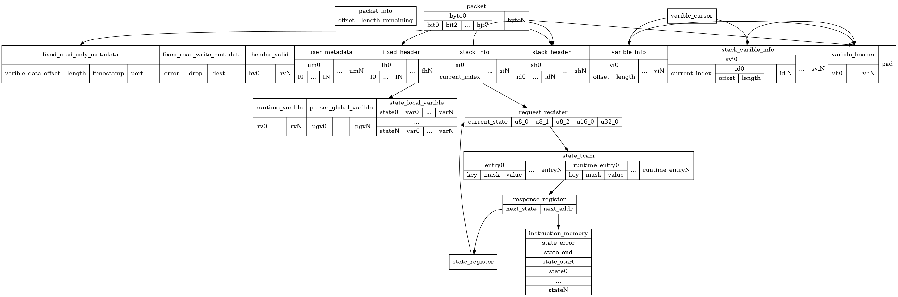

# parser high level design

## 简介

本文描述了parser的概要设计

## 实现方案

### 数据结构



1. packet_info
    1. offset
    1. length_remaining
1. packet
    1. byteX
        1. bitX
1. varible_cursor
1. local_buffer
    1. runtime_varible
        1. rvX
    1. parser_global_varible
        1. pgvX
    1. state_local_varible
        1. stateX
            1. varX
1. data_buffer
    1. fixed_read_only_metadata
        1. varible_data_offset
        1. length
        1. timestamp
        1. port
        1. other
    1. fixed_read_write_metadata
        1. error
        1. drop
        1. dest
        1. other
    1. header_valid
        1. hvX
    1. user_metadata
        1. umX
            1. fX
    1. fixed_header
        1. fhX
            1. fX
    1. stack_info
        1. siX
            1. current_index
    1. stack_header
        1. shX
            1. idX
    1. varible_info
        1. viX
            1. offset
            1. length
    1. stack_varible_info
        1. sviX
            1. current_index
                1. idX
                    1. offset
                    1. length
    1. varible_header
        1. vhX
    1. pad
1. state_tcam
    1. state_tcam
        1. entryX
            1. key
            1. mask
            1. value
        1. runtime_entryX
            1. key
            1. mask
            1. value
1. state_register
1. request_register
    1. current_state
    1. u8_0
    1. u8_1
    1. u8_2
    1. u16_0
    1. u32_0
1. response_register
    1. next_state
    1. next_addr
1. instruction_memory
    1. state_error
    1. state_end
    1. state_start
    1. stateX

---

1. packet in
    1. parser的数据输入，数据粒度为bit，只读
1. packet cursor
    1. 存储当前的packet解析的偏移
    1. 用于extract、lookahead、advance操作后更新
    1. 当extract操作时，从packet in的offset位置，复制一定bit数到header区
    1. state start时初始化
1. 定长header的数据区
    1. 一段线性存储区，数据粒度为字节，用于存储定长header数据
    1. 当用户定义header结构时，header中的所有定长成员被分配至该空间内，长度对齐byte。在编译器即可确定每一个header成员对应的偏移和长度
    1. 由parser extract操作，把数据从packet in拷贝至该区域
1. 变长header的信息区
    1. 一段线性存储区，数据粒度为字节，用于存储变长header的信息，用于索引边长header数据区的偏移和长度，用于通过相对地址访问变长header中的数据
    1. 当用户声明多个变长header结构时，对应分配对应数量的变长header信息entry，
    1. 每一条entry包含以下成员
        1. offset，即变长header被extract到变长header数据区内的数据偏移
        1. size，即变长header被extract到变长header数据后的实际数据长度
    1. 当parser extract变长数据时，数据写入变长header数据区后，把对应的数据区中的offset和size写入信息区
1. 变长header的数据区
    1. 一段线性存储区，数据粒度为字节，用于存储变长header的数据
    1. 包含一个cursor，parser初始阶段进行初始化，当parse extract变长数据时，packet in数据赋值至cursor为起始的地址，然后cursor更新
1. header valid区
    1. 一段线性存储区，数据粒度为bit，用户存储header valid状态值
    1. bit数据的地址即对应header的index，该index由编译时确定，每一个bit表示一个header的valid状态
    1. paser阶段开始时，需要初始化，
    1. 当extract操作时，需更新对应header的valid值
1. errno区
    1. 存储错误状态值，
    1. 当extract失败时，存入预置的error
    1. 当verify失败时，存储接口参数传入的error
    1. accept时，值为noerror
1. 设备metadata区
    1. 一段线性存储区，数据粒度为bit，用于存储硬件的元数据信息
    1. 包含drop flag，当parser reject时需要设置该值
    1. 硬件元数据为硬件相关，在编译时已确定格式
1. 用户metadata区
    1. 一段线性存储区，数据粒度为字节，用于存储生命周期超出parser的数据
    1. 由用户进行声明和初始化
    1. 在编译期确定每个数据成员的地址分配
1. 局部变量区
    1. 用于存储生命周期在parser内的数据，一些为parser内声明，一些为state内声明
    1. 在编译期确定每个数据成员的生命周期，可以复用资源
1. 全局变量区
    1. 支持value set语法，用于运行时修改，
    1. 用于parser执行阶段的运算
1. state表
    1. 一块tcam数据空间，用于state select语句的匹配
    1. 其中的entry支持value set语法，可以运行时修改
    1. tcam中的entry在编译期进行分配和下发
1. state register
    1. 存储当前state的状态值，当语句处于一个state时，该值为确定值，用于select语法查表时组key，
    1. state值由编译器分配
    1. 当transition跳转新的state时，需要更新该寄存器为当前state的值
    1. state start时需要初始化该值
1. state request区
    1. 包含多个register，包括state register和变量register，用于存储state查表请求的lookup key
    1. 当执行select语句时，给register进行赋值，未使用的需要赋值0
    1. register的分配由编译期指定和分配，并生成select语法时的组key流程
1. state response区
    1. 使用gpr，存储select跳转后的next state地址
    1. 当response返回时，返回下一个state语句的起始地址，transition语句跳转至该地址
1. 指令存储区
    1. 存储parser代码，线性存储，只读
1. state start proc addr register
    1. 存储start state的起始代码地址
1. state error proc addr
    1. 存储error发生后的处理起始代码的地址

## 数据结构伪代码

``` c

```

## 参考链接

1. [p4 16 spec](https://p4.org/p4-spec/docs/P4-16-v1.2.4.html#sec-packet-parsing)
